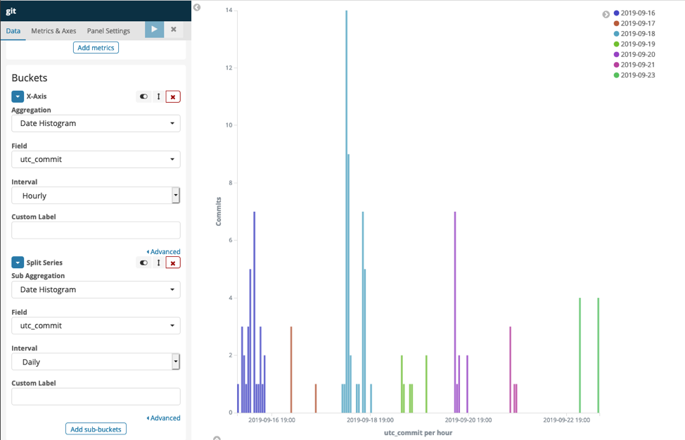
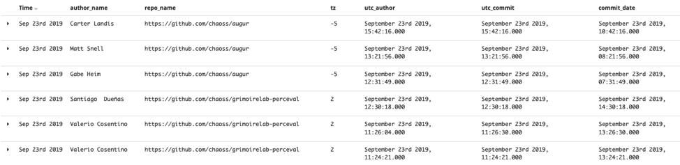
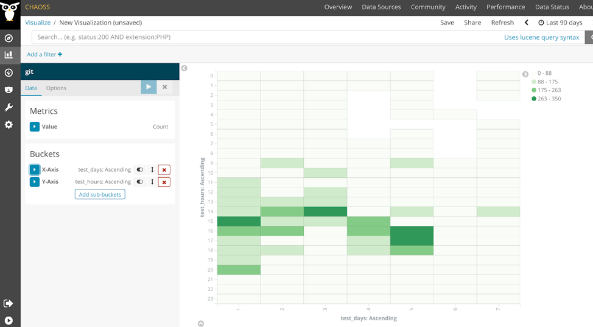
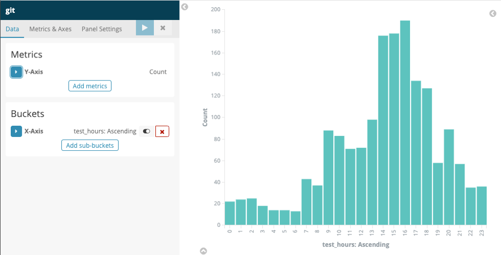

# 活跃的日期和时间

问题：贡献者活跃的日期和时间戳是什么时候？

## 描述

个人在一天的不同时间参与开源项目活动。 此指标旨在确定个人活动完成的日期和时间。 在非 UTC 时区，数据可用于概率性估计贡献在地球上的来源位置。

## 目标

* 为雇主提高透明度，帮助其了解组织员工参与开源项目的时间
* 为开源项目和社区管理者提高透明度，帮助其了解活动发生的时间

## 实现

### 筛选条件
* 通过组织筛选个人
* 统一按UTC时间
  - 可以显示全球贡献时间分布；项目最活跃时间。
* 统一按当地时间
  - 可以显示贡献者做贡献时的当地时间。 可以得到结论贡献者是在工作时间贡献更多还是在晚间（非工作时间）贡献更多。
* 仓库 ID
* 社区细分（例如，GrimoireLab 在欧盟时区更活跃，Augur 在美国时区更活跃）

### 可视化效果

### 提供指标的工具

[GrimoireLab](https://chaoss.github.io/grimoirelab/)

[Augur 日期/时间戳](https://docs.augur.net/#dates-timestamps)

## 参考资料

[协调世界时](https://en.wikipedia.org/wiki/Coordinated_Universal_Time)
