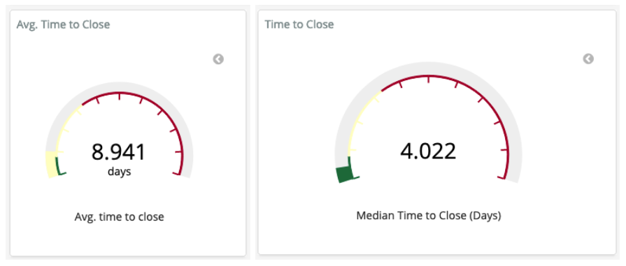

# 关闭时长

问题：创建和关闭操作（如问题、更改请求或支持票证）之间需要多少时间？

## 描述
关闭时长是指从创建到关闭操作（如问题、审查或支持票证）的总时长。 操作需要具有打开和关闭的状态，比如代码审查进程、问答论坛、票证系统中经常出现的情况。

相关指标：[问题解决时长](https://chaoss.community/metric-issue-resolution-duration/)

## 目标
1. 确定社区的响应程度，帮助增加包容性，吸引新贡献者并保留现有贡献者。
2. 找出导致操作快速或缓慢关闭的操作特征（如寻找最佳实践、改进领域、评估效率）。
3. 识别倾向，及时应对不同的社区成员。
4. 检测社区活动的变化（例如，显示潜在的维护者倦怠、贡献多元化的减少）

## 实现

### 筛选条件

* 操作的创建者（例如，新贡献者相对于维护者）
* 最初关闭，最后关闭
* 问题标签（例如错误与新功能）

### 可视化效果

### 提供指标的工具

Augur 实现：
* [问题解决时长](http://augur.osshealth.io/api_docs/#api-Evolution-Closed_Issue_Resolution_Duration(Repo))
* [问题持续时间](http://augur.osshealth.io/api_docs/#api-Evolution-issue-duration-repo)
* [问题响应时间](http://augur.osshealth.io/api_docs/#api-Evolution-Issue_Response_Time(Repo))

GrimoireLab 实现：
* [拉取请求效率](https://chaoss.github.io/grimoirelab-sigils/panels/github-pullrequests-efficiency/)
* [问题效率](https://chaoss.github.io/grimoirelab-sigils/panels/github-issues-efficiency/)
* [Efficiency:TimingOverview](https://chaoss.github.io/grimoirelab-sigils/panels/efficiency-timing-overview/)

### 数据收集策略

关闭时长指标可根据项目活动和目标的具体情况而定。 例如，错误报告的关闭时长可能提供与新功能请求的关闭时长不同的信息。 数据收集策略应解决不同的项目目标。 可能影响这些进程的其他变量是：
* 问题跟踪系统：如错误报告、蓝图 (OpenStack nomenclatura)、用户故事（user story）、功能请求、epic等可能会影响事件关闭时长的问题类型。 优先级或严重性等其他变量可能有助于推进这一事件的关闭速度。
* 代码审查进程：这取决于代码审查基础架构，如 Gerrit、GitHub 或邮件列表（如 Linux 内核中），并可能根据进程的复杂程度而有所不同。 例如，新人和经验丰富的高级开发者将以不同的方式开展进程，所需时间或多或少。
* 问答论坛：这取决于回答的质量和提问者的意见。 有效答案会被标记，提问者成功找到自己问题的正确答案后，进程随即关闭。

## 参考资料
* “Practice P.12: Respond to all submissions”，出自“Appendix to: Managing Episodic Volunteers in Free/Libre/Open Source Software Communities”，Ann Barcomb、Klaas-Jan Stol、Brian Fitzgerald 和 Dirk Riehle：https://opus4.kobv.de/opus4-fau/frontdoor/index/index/docId/13519  
