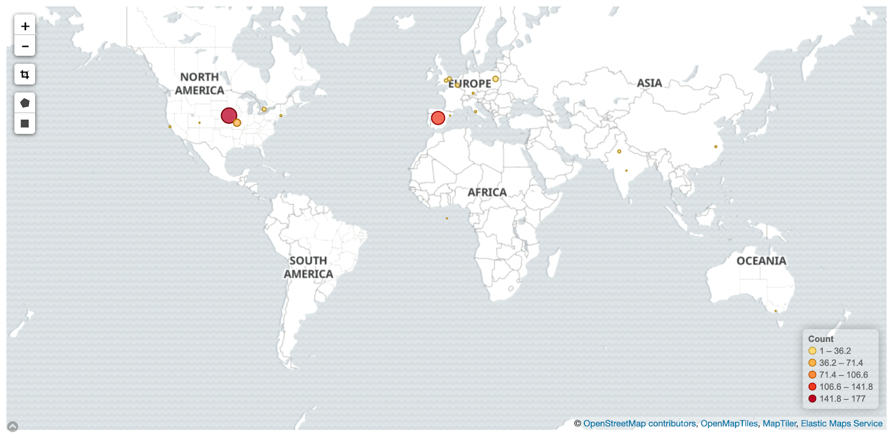
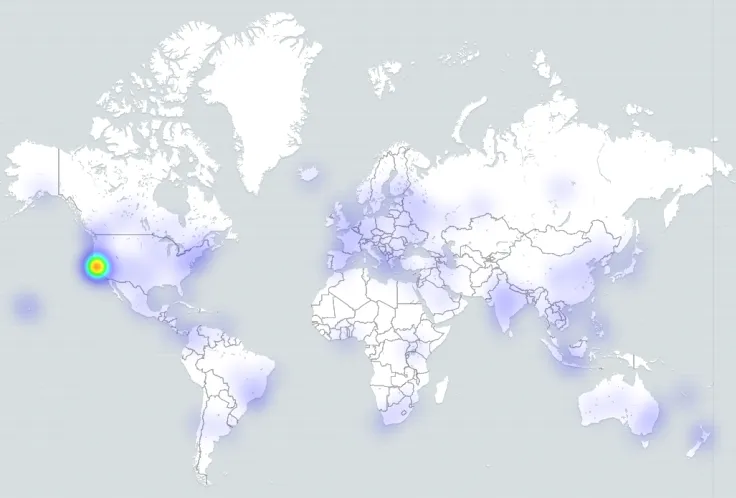

# 贡献者位置

问题：贡献者的位置在哪里？

## 描述

贡献者所处的地理位置、居住地或工作地。

## 目标

确定贡献者的全球位置，了解工作惯例和时区。 确定没有贡献的区域，以提高这些区域的参与度；

## 实现

### 筛选条件

按以下条件筛选贡献：

* **位置。**将各区域的位置分组，以进行多级报告。 在此语境中，“位置”是一个故意模糊的术语，可以指地区、国家、州、地域或时区。
* **时间段。**开始日期和完成日期。 默认：永久。 计算贡献的时期。
* **贡献者类型**，例如：
  * 仓库作者
  * 问题作者
  * 代码审查(Code Review)参与者
  * 邮件列表作者
  * 事件参与者
  * IRC 作者
  * 博客作者
  * 按发布周期
  * 项目的编程语言
  * 项目中的角色或职能

### 可视化效果

点密度图：  来源：[https://chaoss.biterg.io/goto/a62f3584a41c1c4c1af5d04b9809a860](https://chaoss.biterg.io/goto/a62f3584a41c1c4c1af5d04b9809a860)

可视热图：  来源： [https://blog.bitergia.com/2018/11/20/ubers-community-software-development-analytics-for-open-source-offices](https://blog.bitergia.com/2018/11/20/ubers-community-software-development-analytics-for-open-source-offices)

### 提供指标的工具

*   GrimoireLab
*   Augur

### 数据收集策略

可以采用不同的方法收集位置信息：

*   在参与度系统中收集贡献者资料的位置信息。
*   使用做出贡献的最频繁位置的 IP 地址地理定位。
*   根据贡献中的时间戳推断地理位置。
*   调查贡献者。

确定贡献者的位置是数据收集的关键挑战。 最佳实践是利用参与度系统提供的各种资料信息，如果没有这些信息，可以使用 IP 地理定位来确定该个人最频繁的贡献位置。 注意，贡献者可能会在个人资料信息中输入虚假或无意义的位置信息（如“地球”或“互联网”）。 注意，IP 地理定位可能会由于 VPN 或其他 IP 屏蔽工具提供大量误报。

另一个考虑因素是外部数据收集工具，如社区调查或事件登记数据，可能交叉引用参与概况的系统。 贡献者位置数据可与事件[参与者统计信息](https://chaoss.community/metric-attendee-demographics/)和[演讲者统计信息](https://chaoss.community/metric-speaker-demographics/)内联收集。

## 参考资料

*   Gonzalez-Barahona, J. M., Robles, G., Andradas-Izquierdo, R., & Ghosh, R. A. (2008). Geographic origin of libre software developers. _Information Economics and Policy_, _20_(4), 356-363.
