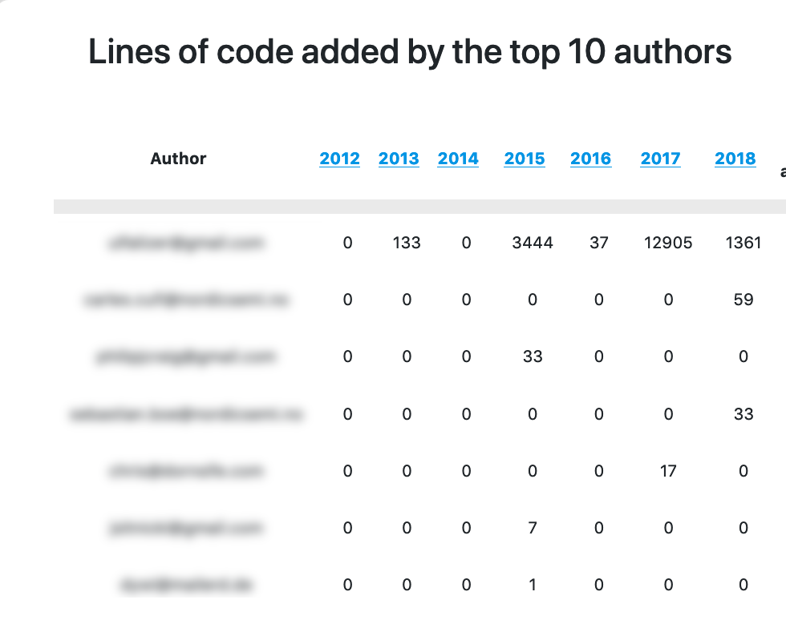
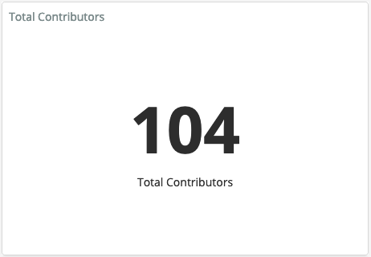
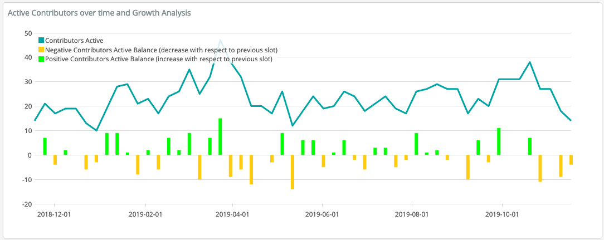
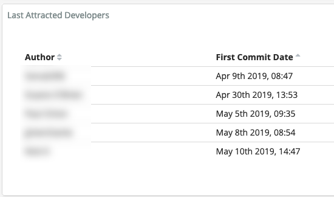

# 贡献者

问题：谁是项目的贡献者？

## 描述

贡献者是指以任意方式为项目做出贡献的人。 这一指标确保所有类型的贡献在项目中都能得到充分认可。

## 目标

开源项目由许多贡献者组成。 认识项目的所有贡献者对于了解个人参与的活动非常重要，比如谁在帮助代码开发、事件规划和营销工作等。

## 实现

从项目使用的协作工具中收集作者姓名。

**聚合器：**
* 计数。 给定时间内的贡献者总数。

**参数：**
* 时间段。 开始日期和完成日期。 默认：永久。 计算贡献的时期段。

### 筛选条件

按参与地点。 例如：
* 提交作者
* 议题作者
* 审查参与者，例如拉取请求中
* 邮件列表作者
* 事件参与者
* IRC 作者
* 博客作者
* 按发布周期
* 项目活动的时间框架，例如，寻找新贡献者
* 项目的编程语言
* 项目中的角色或职能

### 可视化效果

1. 贡献者名称列表（通常带有参与程度的信息）  

2. 贡献者人数汇总  

3. 活跃贡献者数量随时间的变化  

4. 新贡献者（按首次贡献日期对贡献者排序）  

### 提供指标的工具

* [GrimoireLab](https://chaoss.github.io/grimoirelab/)
* [Augur](http://augur.osshealth.io/api_docs/#api-Evolution-Contributors_Repo_)

### 数据收集策略

如上所述，部分贡献者信息可以通过 GrimoireLab 和 Augur 等软件获得。 然而，有些贡献者洞察不太容易通过跟踪数据获得。 在这些情况下，使用社区成员调查或事件注册的方式可以提供所需信息。 示例问题包括：

* 采访问题：通常哪些贡献者不会出现在贡献者列表中？
* 采访问题：哪些贡献者经常不被视为重要贡献者，因为其贡献更倾向于“幕后”？
* 采访问题：您经常与哪些社区成员合作？

此外，社区成员调查可以提供有关项目贡献的更多信息。 示例问题包括：

* 李克特量表 [1-x] 项：我正在为项目做贡献
* 矩阵调查项：您在项目中多久参与一次以下活动？
  * 列标题：从不，很少（每月少于一次），有时（每月一次以上），经常（每周一次或多次）
  * 行包括：a) 贡献/审查代码，b) 创建或维护文档，c) 翻译文档，d) 参与项目开发决策，e) 担任社区组织者，f) 指导其他贡献者，g) 亲自参与事件，h) 通过学校或大学计算机项目参与，i) 通过 Outreachy、Google Summer of Code 等计划参与，j) 帮助 ASF 运作（如委员会会议或筹款）

## 参考资料
