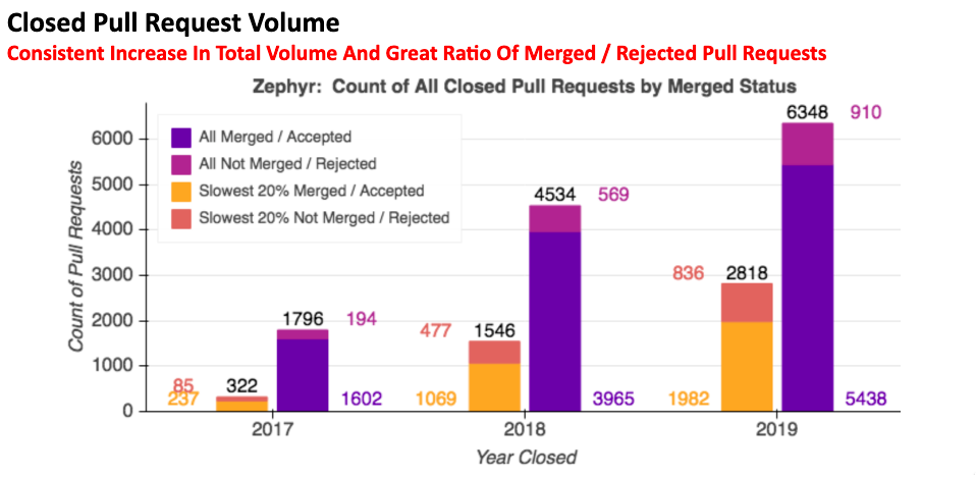
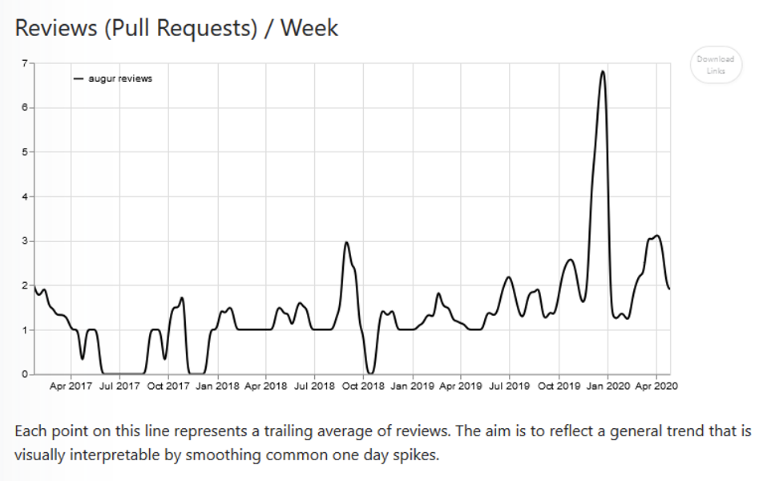
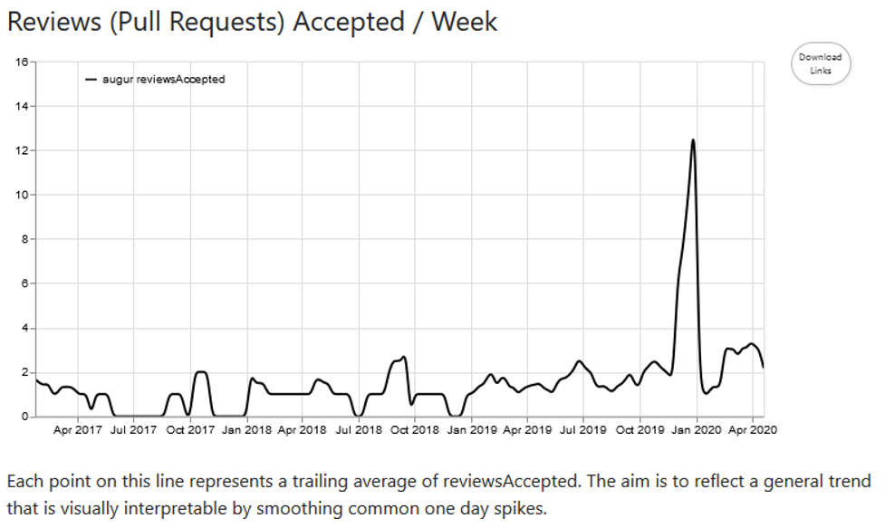

# 变更请求接受率

问题: 接受的变更请求与未合并而关闭的变更请求的比率是多少?

## 描述
每个变更请求都可以处于以下三种状态之一：打开、合并（接受）和关闭而不合并（拒绝）。此指标衡量合并（接受）的变更请求与关闭但未合并的变更请求的比率。

## 目标
合并的变更请求与未合并而关闭的变更请求的比率提供了对多个代码仓特征的洞察，包括对外部贡献的开放性、贡献者社区的发展、代码审查过程的效率，以及随着时间的推移衡量项目发展的轨迹。应该基于每个代码仓或项目来诠释比率的差异。

## 实现
**参数**
* 时间段粒度 (每周, 每月, 每年)。 
* 一段时间内的比率变化。
* 显示贡献者数量
* 变更请求的来源：branch还是fork？来自代码仓fork的变更请求更常见于外部贡献者，而由branch发起的变更请求来自具有代码仓提交权限的人

***聚合器**
* 合并的变更请求总数（已接受）
* 未合并而关闭的变更请求总数
* 处于打开状态的变更请求总数

### 可视化效果

CHAOSS 工具为此指标提供了许多可视化图形。 第一个可视化显示了每年接受和拒绝的变更请求，从中可以得出比率。

图形 1:

图形 2:

图形 3:

### 提供度量的工具
* https://github.com/chaoss/augur
* https://github.com/chaoss/augur-community-reports

### 数据收集策略

接受的变更请求 [Change Requests Accepted](https://chaoss.community/metric-change-requests-accepted/) 指标, 以及
拒绝的变更请求 [Change Requests Declined](https://chaoss.community/metric-change-requests-declined/) 指标。

## 参考资料
Augur Zephyr 关于拉取请求的报告: https://docs.google.com/presentation/d/11b48Zm5Fwsmd1OIHg4bse5ibaVJUWkUIZbVqxTZeStg/edit#slide=id.g7ec7768776_1_56
