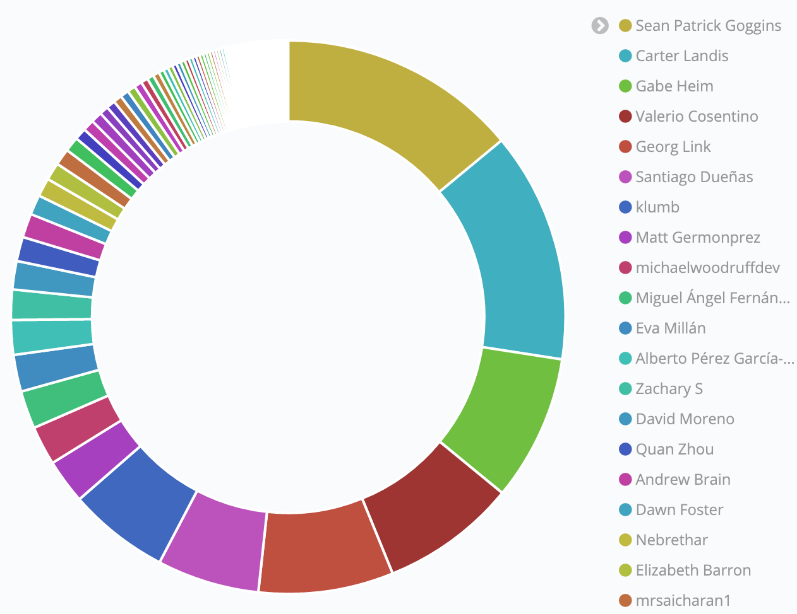

# **巴士系数**

问题：如果最活跃的人离开，项目会产生多大风险？

## 描述  
巴士系数是一个引人注目的指标，因为它形象化了“我们失去多少贡献者就会使项目停滞？”的问题。假设这些贡献者被一辆公共汽车撞了，（换个令人容易接受点的说法是，有多少人必须在彩票中获胜并决定继续前进）。

巴士系数是贡献超过整个项目50%的最少人数。

## 目标  
* 确定项目工作在贡献者之间分布的范围。
* 确定项目中负责大部分工作的关键人员。

## 实现  
巴士系数的公式是一个百分比计算-50%将是我们的阈值-
然后将每个贡献者的贡献按降序排序，直到贡献总和到达
门槛。

如果我们有 8 个贡献者，每个贡献者在项目中的贡献值如下：`1000, 202, 90, 33, 332, 343, 42, 433`，那么我们可以按照降序排序后从最大值开始求和，用第一次超过贡献总数的 50% 的贡献者个数来确定巴士系数。

**答案:** 贡献值的50% = `1,237.5`, 所以巴士系数为 `2`.

**求解过程:**

1. 按降序排列数据：`1000, 433, 343, 332, 202, 90, 42, 33` 
2. 计算总数的 50%:
   -  `(1,000 + 433 + 343 + 332 + 202 + 90 + 42 + 33) * 0.5 = 1,237.5`
3. 将排名中的前2个贡献者相加，我们得到 `1,433`.
4. **答案**：因为`1,433 > 1,237.5`，超过50%的贡献仅由`2`贡献者完成，因此`巴士系数 = 2`。

### 筛选条件
* 时间：巴士系数可能因不同的时间段而异。项目生命周期内的巴士系数可能会歪曲项目中贡献者的当前参与程度.
* 代码仓库组：许多开源项目包含多个代码仓库，在某些情况下，检查与任何给定项目关联的所有代码仓库可提供更完整的巴士系数图像.

### 可视化 (可选项)

仅考虑 git commits时，2020 年 CHAOSS 项目的巴士系数为 5.

### 提供指标的工具
1. [Augur](https://github.com/chaoss/augur)
2. [GrimoireLab](https://chaoss.github.io/grimoirelab) 开箱即用地提供此指标，它不仅仅只是一个数字，而是可视化的.

### 数据收集策略
数据收集策略依赖于用于计算巴士系数的[贡献类型](https://chaoss.community/metric-types-of-contributions/)。 巴士系数通常是以commits数来计算的，但其他类型的贡献也可以用于此目的，它可以单独计算或也可以用不同贡献类型组合计算。

## 参考资料
