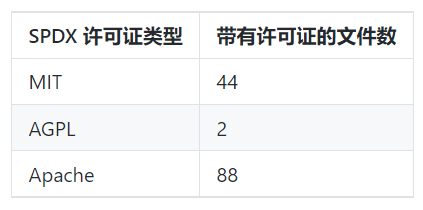

# 声明的许可证

问题：什么是声明的软件包许可证？

## 描述
软件包中声明的特定许可证及其数量。 它涵盖了软件源代码和文档源文件。 此指标是许可证的枚举，以及带有该特定许可证声明的文件数。 例如：

## 目标
声明的特定许可证及其数量在以下几种场景中至关重要：
1. 软件包的不变性使单个软件包可承载多个软件许可证，在获取软件包时，出于合规性考虑，必须了解声明的许可证。 声明的许可证可以为许可证合规性工作提供透明度。
2. 许可证之间可能会产生冲突，使软件包中的所有许可证不能完全履行所有义务。 声明的许可证可以为软件包中存在的潜在许可证冲突提供透明度。

## 实现

### 筛选条件
* 时间：仓库依赖项随时间变化，可能导致仓库中声明的许可证也发生变化。 除了掌握已有许可证的基本信息外之外，跟踪许可证存在的主要动机之一是关注意外的新许可证引入。
* 已声明和未声明：单独枚举具有许可证声明的文件和没有许可证声明的文件。

### 提供指标的工具

 1. [Augur](https://github.com/chaoss/augur)

 可在任意 [Augur Risk页面](http://augur.osshealth.io/repo/Zephyr-RTOS/zephyr/risk)的“声明的许可证”下找到声明的许可证。

 2. [Augur-SPDX](https://github.com/chaoss/augur-spdx)

Augur-SPDX 包以 Augur 插件的形式提供，并使用这一数据模型存储文件级许可证信息。 具体而言：
* 每个 `package`（repository）都可以有一个声明的或未声明的许可证，由仓库中所有文件的扫描决定。
* 每个 `package` 还可以具有多个不同的非代码`documents`，这其中是 SPDX 许可证声明。
* 每个 `file` 可以与一个或多个 `packages_files` 关联。 通过 `files` 和 `packages_files` 之间的关系，Augur-SPDX 让大量仓库中的一个文件可以成为多个包的一部分，尽管在实践中这似乎不太可行。
* `packages` 和 `packages_files` 在两个方向上都具有一对多的关系。 本质上，这让每个 `file` 都更有可能成为多个 `package` 的一部分，同样的，每个 `package` 通常都将包含许多 `package_files`。
* `licenses` 与 `files` 和 `packages_files` 关联。 每个 `file` 都可能具有不止一个 `licenses` 引用，例如 `license` 声明在`Augur-SPDX` 每次扫描仓库之间均可能发生变化。 每个 `package` 均按照最近一次进行存储，每个 `packages_file` 都可以有一个 `license` 声明。

## 参考资料

* https://spdx.org/
* https://www.fossology.org
